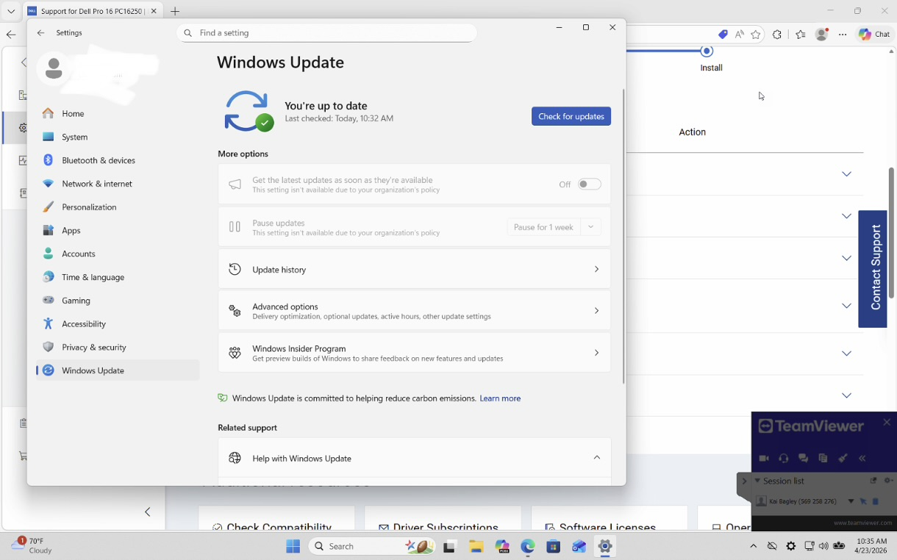
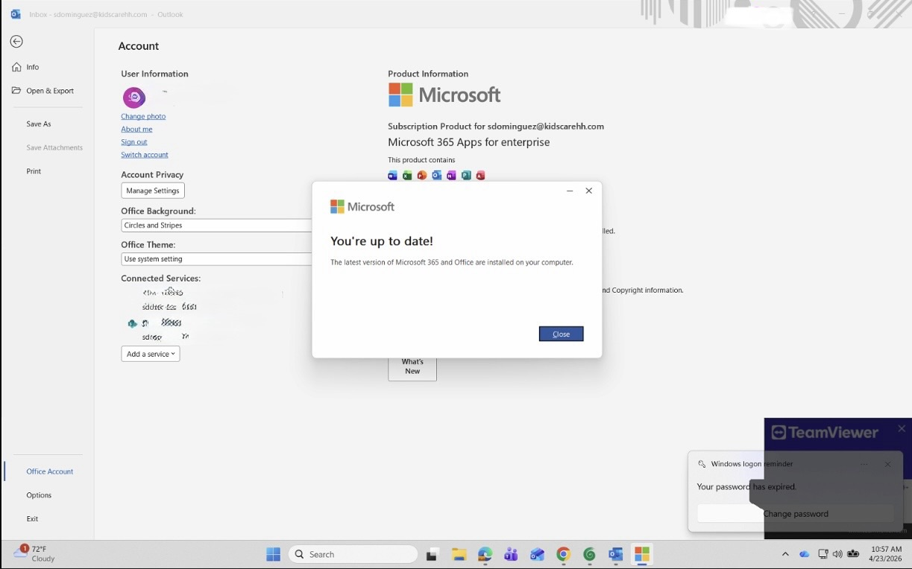
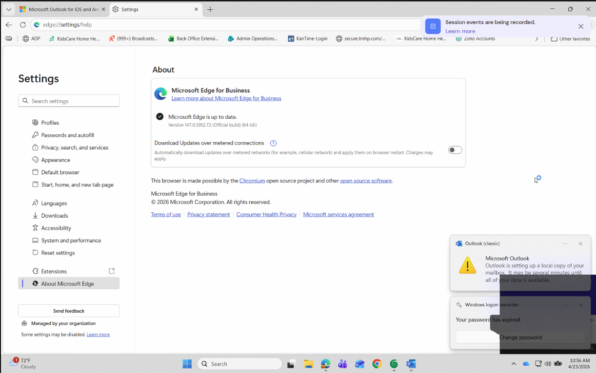
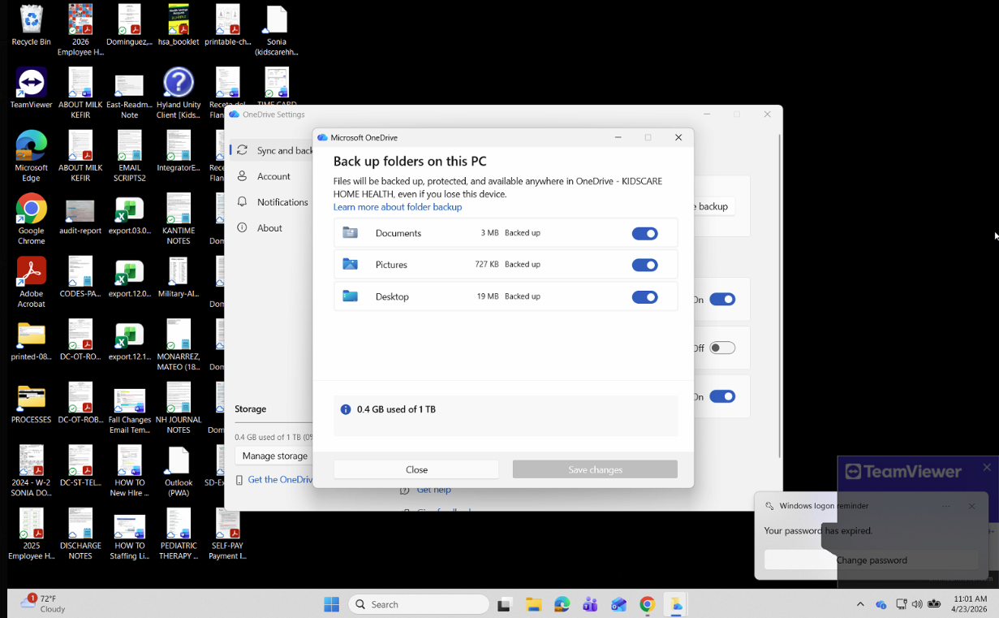
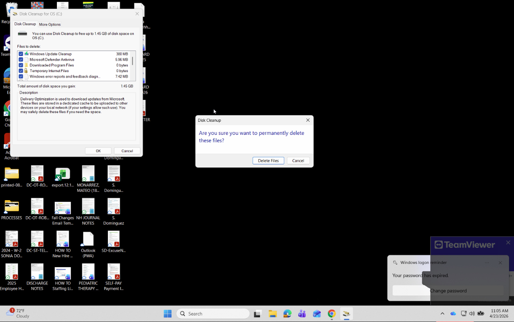
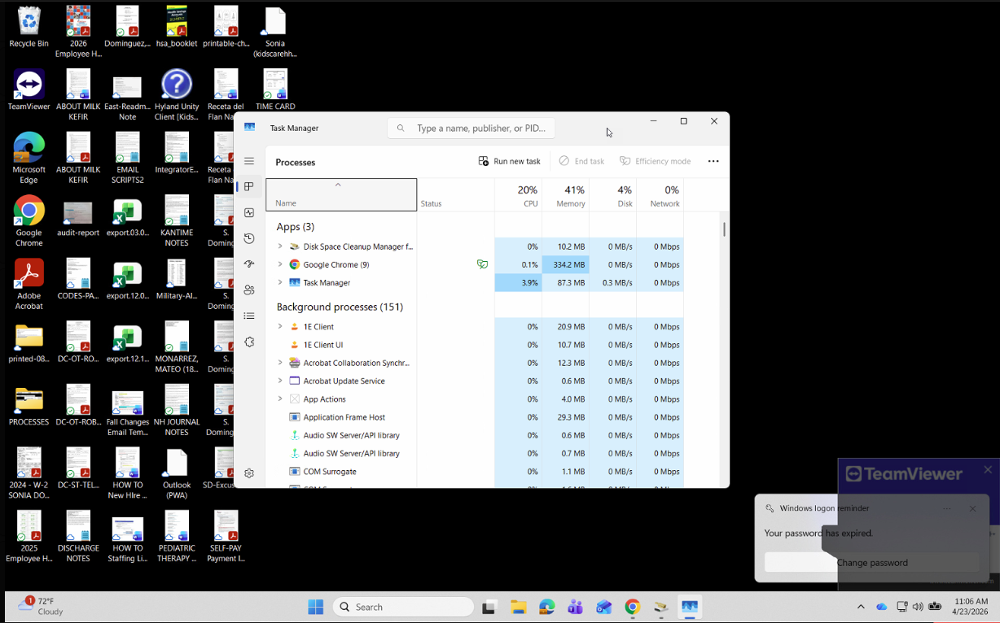
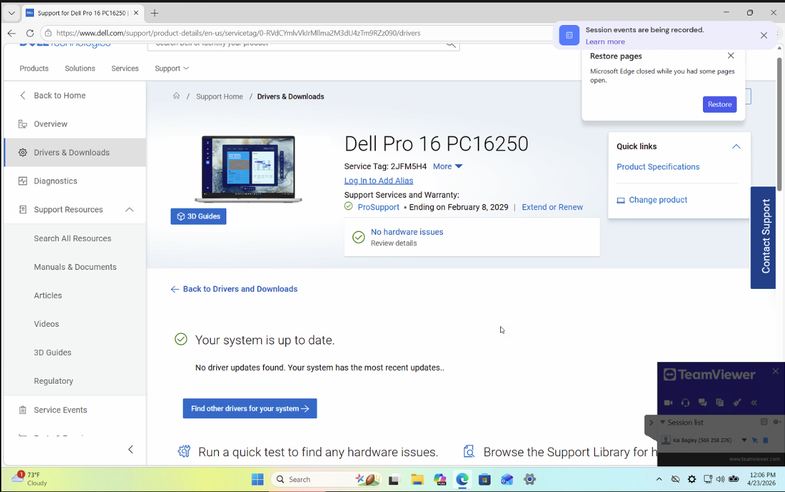

# Windows-Endpoint-Maintenance
Documenting Windows endpoint maintenance, software updates, antivirus checks, performance monitoring, OneDrive, and Intune compliance.
# Windows Endpoint Maintenance & Preventive Care

## Project Overview

This project documents a structured preventive maintenance workflow for Windows business computers. The goal is to maintain endpoint security, improve reliability, verify backup synchronization, and identify issues that require troubleshooting or escalation.

This portfolio project is based on common IT desktop support practices and uses a generalized workflow without exposing employer-confidential information.

## Objectives

- Verify Windows operating system updates.
- Check and update business applications and web browsers.
- Review installed applications and identify unnecessary software.
- Verify applicable BIOS, firmware, and driver updates.
- Confirm antivirus protection and security definition status.
- Verify OneDrive synchronization.
- Perform disk cleanup and check available storage.
- Review CPU, memory, and disk utilization.
- Verify endpoint compliance and IT asset assignment.

## Tools and Technologies

- Windows 11
- Windows Update
- Microsoft 365
- Microsoft Teams
- Microsoft Edge and Google Chrome
- Adobe applications and Snagit
- Endpoint antivirus software
- Microsoft OneDrive
- Microsoft Intune
- Windows Task Manager
- Computer manufacturer support utilities

## Maintenance Procedures

### 1. Operating System Updates

- Check Windows Update for pending updates.
- Install applicable updates according to organizational procedures.
- Restart the computer when required.
- Verify the update status after installation.

### 2. Software Updates

- Review Microsoft 365 and Microsoft Teams update status.
- Check installed applications such as Adobe software and Snagit.
- Confirm supported applications are receiving updates.
- Document failed installations or applications requiring escalation.

### 3. Application Review

- Review installed programs for unnecessary or unsupported software.
- Confirm business requirements before uninstalling applications.
- Remove approved applications using standard IT procedures.

### 4. Firmware and Driver Updates

- Review manufacturer support resources for applicable BIOS, firmware, and driver updates.
- Verify device compatibility before installation.
- Follow approved update and restart procedures.

### 5. Endpoint Security

- Verify that antivirus real-time protection is enabled.
- Check that security definitions are current.
- Perform a full system scan when required.
- Document detections and follow organizational incident response procedures.

### 6. Browser Maintenance

- Check Microsoft Edge and Google Chrome update status.
- Verify automatic updates are enabled where supported.
- Install pending updates.
- Clear browsing data when appropriate and authorized.

### 7. Backup Verification

- Confirm OneDrive is signed in.
- Check synchronization status and identify errors.
- Verify that required files are syncing to the intended location.
- Escalate unresolved synchronization problems.

### 8. Disk Cleanup and Storage

- Remove approved temporary files and unnecessary system files.
- Review available disk space.
- Aim to maintain adequate free storage according to organizational requirements.
- Use Optimize Drives appropriately for the drive type; avoid routine defragmentation of SSDs.

### 9. Performance Checks

Use Windows Task Manager to review:

- CPU utilization
- Memory usage
- Disk activity
- Resource-intensive applications
- Potential performance bottlenecks

Investigate unusual resource usage and document findings.

### 10. Device Compliance and Asset Management

- Verify the endpoint's compliance status in Microsoft Intune.
- Confirm the device is assigned correctly in the authorized IT asset management system.
- Record discrepancies and escalate unresolved issues.

## Sample Maintenance Record

| Check | Status |
|---|---|
| Windows Update | Verified — Windows Update reports "You're up to date" |
| Windows Update Screenshot |  |
| Application Updates ||
| Browser Updates |  |
| OneDrive Synchronization |  |
| Disk Space | |
| Task Manager | |
| Intune Compliance | |
| Dell Drivers |  |

*These are sample documentation statuses, not claims that maintenance was completed on a particular device.*

## Skills Demonstrated

- Windows desktop support
- Endpoint preventive maintenance
- Software update verification
- Antivirus and endpoint security checks
- Disk cleanup and performance monitoring
- OneDrive synchronization troubleshooting
- Microsoft Intune compliance verification
- IT asset management
- Technical documentation and escalation

## Security and Privacy

This project intentionally excludes employee names, usernames, device serial numbers, asset identifiers, internal ticket URLs, company screenshots, credentials, and other confidential information.

All procedures are documented for educational and professional portfolio purposes.

## Conclusion

A consistent endpoint maintenance process helps IT support teams identify outdated software, potential security issues, storage concerns, synchronization problems, and device compliance discrepancies.

The workflow provides a repeatable checklist for preventive maintenance, documentation, validation, and escalation.
